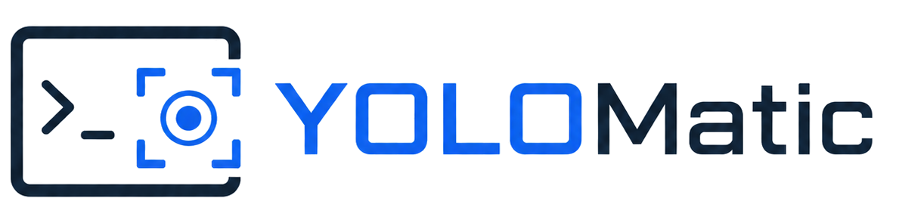
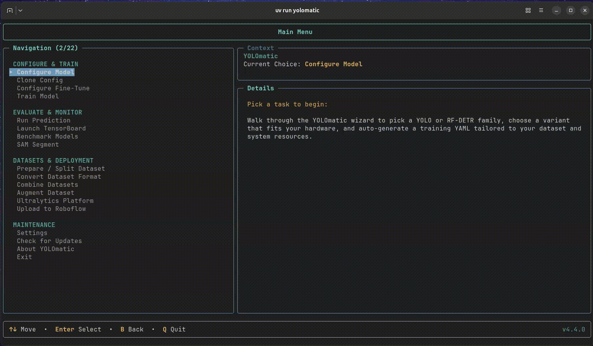
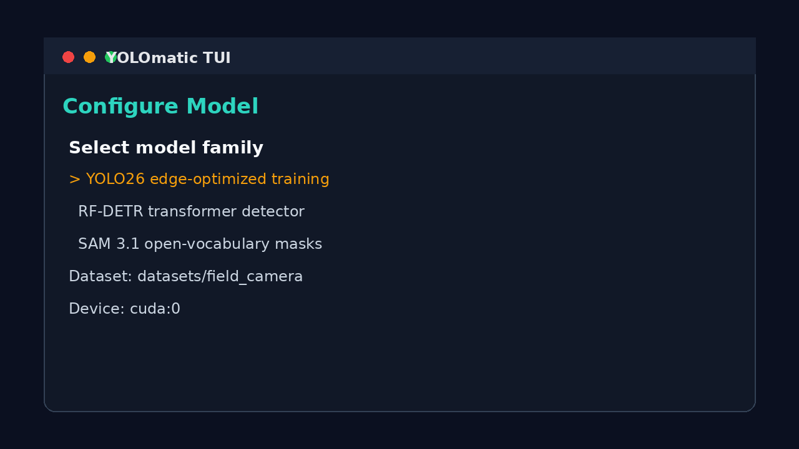
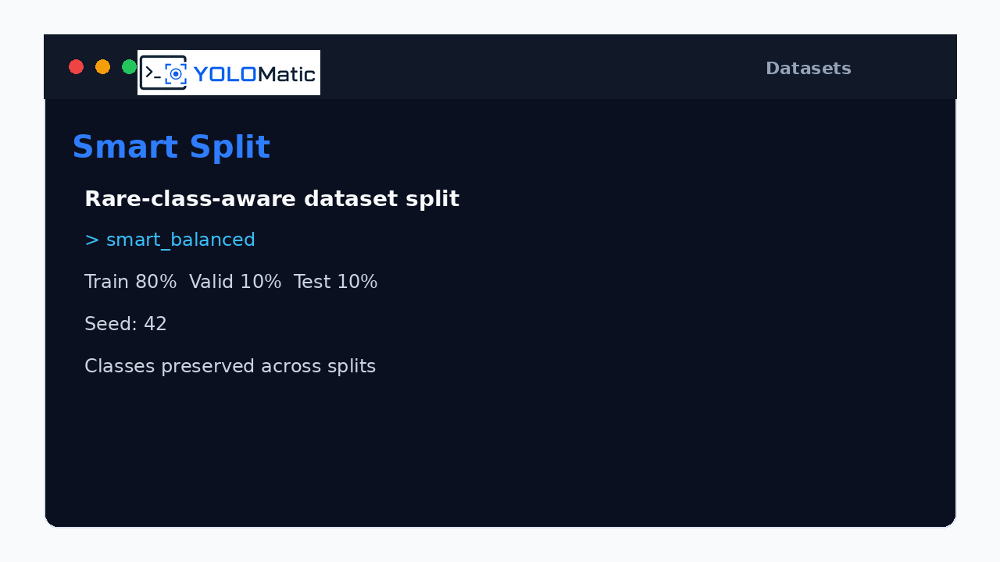

<div align="center">



# YOLOmatic

**Interactive computer-vision training for YOLO, RF-DETR, SAM 3.1, and Detectron2.**

[](https://pypi.org/project/yolomatic/)
[](https://www.python.org/)
[](LICENSE.md)
[](https://github.com/shahabahreini/YOLOMatic/actions)
[](https://github.com/shahabahreini/YOLOMatic/stargazers)
[](https://shahabahreini.github.io/YOLOMatic/)
[](https://github.com/shahabahreini/YOLOMatic/discussions)



</div>

YOLOmatic is a production-focused Python CLI/TUI for configuring, training,
fine-tuning, predicting, benchmarking, augmenting, converting, monitoring, and
uploading computer-vision models. It covers YOLO26/12/11/10/9/8, YOLOX,
RF-DETR, SAM 3.1, and Detectron2 from one terminal workflow.

## Why YOLOmatic

- **Interactive wizard UX:** configure models, datasets, fine-tuning, prediction,
  benchmarking, augmentation, NDJSON conversion, TensorBoard, and upload flows
  without hand-writing boilerplate.
- **Hardware-aware configs:** CUDA, Apple Silicon MPS, CPU fallback, workers,
  batch sizes, and runtime preflight checks are handled before training starts.
- **10+ model families in one CLI:** Ultralytics YOLO, native RF-DETR, SAM 3.1,
  Detectron2, Roboflow upload, ClearML tracking, Labelbox conversion, and local
  benchmark reports.

## 30-Second Quickstart

```sh
uv tool install yolomatic
yolomatic
```

Repository development:

```sh
git clone https://github.com/shahabahreini/YOLOMatic.git
cd YOLOMatic
uv sync
uv run yolomatic
```

Common commands:

```sh
uv run yolomatic-train
uv run yolomatic-predict
uv run yolomatic-benchmark
uv run yolomatic-convert
uv run yolomatic-upload
uv run yolomatic-tensorboard
```

## Feature Matrix

| Area           | YOLOmatic support                                                                     |
| -------------- | ------------------------------------------------------------------------------------- |
| Model families | YOLO26, YOLOv12, YOLO11, YOLOv10, YOLOv9, YOLOv8, YOLOX, RF-DETR, SAM 3.1, Detectron2 |
| Tasks          | Detection, segmentation, classification, pose, OBB, open-vocabulary segmentation      |
| Data           | YOLO folders, COCO JSON, Labelbox NDJSON, Ultralytics-platform NDJSON                 |
| Training       | Fresh training, checkpoint fine-tuning, resume, hardware preflight                    |
| Evaluation     | mAP, F1, per-image rankings, UMAP vector analysis, interactive HTML report            |
| Integrations   | Roboflow, ClearML, TensorBoard, HuggingFace, Ultralytics                              |

## Comparison

| Capability                             | YOLOmatic | Ultralytics CLI | Roboflow              | Hosted YOLO tools |
| -------------------------------------- | --------- | --------------- | --------------------- | ----------------- |
| Interactive terminal wizard            | Yes       | Limited         | Web UI                | Web UI            |
| Multiple YOLO generations              | Yes       | Yes             | Export/deploy focused | Varies            |
| Native RF-DETR training                | Yes       | No              | Deploy focused        | Varies            |
| SAM 3.1 workflows                      | Yes       | No              | Limited               | Varies            |
| Detectron2 training                    | Yes       | No              | No                    | Varies            |
| Hardware-aware config generation       | Yes       | Manual          | Abstracted            | Abstracted        |
| Labelbox/Ultralytics NDJSON conversion | Yes       | No              | Import focused        | Varies            |
| Local benchmark HTML reports           | Yes       | Partial metrics | Hosted analytics      | Varies            |
| Fully local workflow                   | Yes       | Yes             | No                    | No                |

## FAQ

### What is YOLOmatic?

YOLOmatic is a Python 3.12 command-line toolkit with an interactive terminal UI
for computer-vision training workflows.

### Which model families are supported?

YOLO26, YOLOv12, YOLO11, YOLOv10, YOLOv9, YOLOv8, YOLOX, RF-DETR, SAM 3.1, and
Detectron2.

### Is YOLOmatic only for YOLO?

No. YOLOmatic also supports native RF-DETR training and fine-tuning, SAM 3.1
segmentation workflows, and Detectron2 training.

### Does it require a GPU?

No. CUDA is recommended for training, but CPU and Apple Silicon MPS fallbacks
are supported. YOLOmatic detects common CUDA/PyTorch mismatches and offers repair
guidance.

### Can YOLOmatic convert Labelbox NDJSON?

Yes. It converts Labelbox and Ultralytics-platform NDJSON exports into YOLO or
COCO datasets with concurrent image downloads.

### Can I benchmark trained models?

Yes. `uv run yolomatic-benchmark` generates an interactive HTML report with mAP,
F1, per-image rankings, confidence inspection, thumbnails, and UMAP vectors.

### Can I export models for deployment?

Yes. `uv run yolomatic-export` exports trained YOLO `.pt` weights to TensorRT,
ONNX, OpenVINO, CoreML, TFLite, TorchScript, NCNN, RKNN, and other Ultralytics
formats. TensorRT workspace is user-controlled so it can be tuned for the GPU
that builds the engine. The export wizard reads the selected checkpoint details
first, then hides options that do not apply to that model task or export format.

### Can I upload models to Roboflow?

Yes. YOLOmatic uploads YOLO checkpoints and deploys RF-DETR checkpoints through
the upload TUI or optional post-training upload config.

## Screenshots

| Configure Model                                                               | Smart Split                                                           |
| ----------------------------------------------------------------------------- | --------------------------------------------------------------------- |
|  |  |

## Links

- [Full documentation](https://shahabahreini.github.io/YOLOMatic/)
- [Install guide](https://shahabahreini.github.io/YOLOMatic/getting-started/install/)
- [Models guide](https://shahabahreini.github.io/YOLOMatic/guides/models/)
- [YOLO guide](https://shahabahreini.github.io/YOLOMatic/guides/yolo/)
- [Dataset guide](https://shahabahreini.github.io/YOLOMatic/guides/datasets/)
- [Comparison](https://shahabahreini.github.io/YOLOMatic/comparison/)
- [Changelog](CHANGELOG.md)
- [Contributing](CONTRIBUTING.md)
- [Citation](CITATION.bib)

## Citation

```bibtex
@software{bahreini_jangjoo_yolomatic_2026,
  author = {Bahreini Jangjoo, Shahab},
  title = {{YOLOmatic}: automated computer-vision training CLI for YOLO, RF-DETR, SAM, and Detectron2},
  year = {2026},
  version = {4.4.0},
  license = {Apache-2.0},
  url = {https://github.com/shahabahreini/YOLOMatic},
  note = {Python CLI/TUI for configuring, training, fine-tuning, predicting, benchmarking, and uploading computer-vision models}
}
```

## License

YOLOmatic is licensed under [Apache 2.0](LICENSE.md).

## Acknowledgments

YOLOmatic builds on the Python computer-vision ecosystem, including Ultralytics,
RF-DETR, SAM/HuggingFace, Detectron2, PyTorch, Albumentations, ClearML,
TensorBoard, Roboflow, and MkDocs Material.
